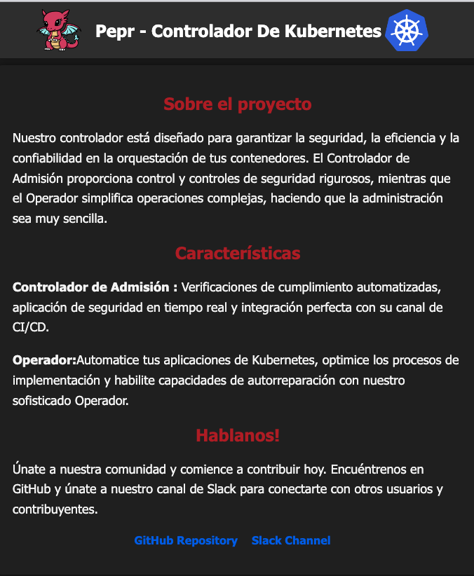

# WebApp Operator

The WebApp Operator deploys the `CustomResourceDefinition` for WebApp, then watches and reconciles against instances of WebApps to ensure the desired state meets the actual cluster state.

The WebApp instance represents a `Deployment` object with confirgurable replicas, a `Service`, and a `ConfigMap` that has a `index.html` file that can be configured to a specific language, and theme. The resources the Operator deploys contain `ownerReferences`, causing a cascading delete effect when the WebApp instance is deleted.

If any object deployed by the Operator is deleted for any reason, other than through the `ownerReference` mechanism, the Operator will abruptly redeploy the object. 

## Demo

_Create an ephemeral cluster. (Kind or k3d will work)_


Deploy the Operator 

```bash
kubectl apply -f dist/pepr-module-774fab07-77fa-517c-b5f8-c682c96c20c0.yaml
kubectl wait --for=condition=Ready pods -l app -n pepr-system --timeout=120s
```

Notice that the WebApp CRD has been deployed

```bash
kubectl get crd | grep webapp
```

Explain the `WebApp.spec`

```bash
kubectl explain wa.spec

# output
GROUP:      pepr.io
KIND:       WebApp
VERSION:    v1alpha1

FIELD: spec <Object>

DESCRIPTION:
    <empty>
FIELDS:
  language      <string> -required-
    Language defines the language of the web application, either English (en) or
    Spanish (es).

  replicas      <integer> -required-
    Replicas is the number of desired replicas.

  theme <string> -required-
    Theme defines the theme of the web application, either dark or light.
```

Create an instance of a `WebApp` in English with the light theme and 1 replica

```yaml
kubectl create ns webapps;
kubectl apply -f -<<EOF
kind: WebApp
apiVersion: pepr.io/v1alpha1
metadata:
  name: webapp-light-en
  namespace: webapps
spec:
  theme: light 
  language: en
  replicas: 1 
EOF
```

Check that the `ConfigMap`, `Service` and `Deployment` are deployed

```bash
kubectl get cm,svc,deploy -n webapps

# output
NAME                                    DATA   AGE
configmap/kube-root-ca.crt              1      6s
configmap/web-content-webapp-light-en   1      5s

NAME                      TYPE        CLUSTER-IP   EXTERNAL-IP   PORT(S)   AGE
service/webapp-light-en   ClusterIP   10.43.85.1   <none>        80/TCP    5s

NAME                              READY   UP-TO-DATE   AVAILABLE   AGE
deployment.apps/webapp-light-en   1/1     1            1           5s
```

Get the Status of the WebApp

```json
kubectl get wa webapp-light-en -n webapps -ojsonpath="{.status}" | jq  

# output
{
  "observedGeneration": 1,
  "phase": "Ready"
}
```

Describe the WebApp

```bash
kubectl  describe wa webapp-light-en -n webapps

# output
Name:         webapp-light-en
Namespace:    webapps
Labels:       <none>
Annotations:  <none>
API Version:  pepr.io/v1alpha1
Kind:         WebApp
Metadata:
  Creation Timestamp:  2024-04-08T16:02:31Z
  Generation:          1
  Resource Version:    1037
  UID:                 435c3f0a-3002-48ad-a897-c1fe24903c11
Spec:
  Language:  en
  Replicas:  1
  Theme:     light
Status:
  Observed Generation:  1
  Phase:                Ready
Events:
  Type    Reason                    Age   From             Message
  ----    ------                    ----  ----             -------
  Normal  InstanceCreatedOrUpdated  27s   webapp-light-en  Pending
  Normal  InstanceCreatedOrUpdated  27s   webapp-light-en  Ready
```

Port-forward and look at the WebApp in the browser

```bash
kubectl port-forward svc/webapp-light-en -n webapps 3000:80
```
[WebApp](http://localhost:3000)


Delete the `ConfigMap` on the WebApp to watch it the operator reconcile it back

```bash
kubectl delete cm -n webapps --all 
# wait a few seconds
kubectl get cm -n webapps 

# output
configmap "kube-root-ca.crt" deleted
configmap "web-content-webapp-light-en" deleted
NAME                          DATA   AGE
kube-root-ca.crt              1      0s
web-content-webapp-light-en   1      0s
```

Update the `WebApp` and change the theme to dark and language to spanish

```yaml
kubectl apply -f -<<EOF
kind: WebApp
apiVersion: pepr.io/v1alpha1
metadata:
  name: webapp-light-en
  namespace: webapps
spec:
  theme: dark 
  language: es
  replicas: 1 
EOF
#output
webapp.pepr.io/webapp-light-en configured
```

Port-forward and look at the WebApp in the browser

```bash
kubectl port-forward svc/webapp-light-en -n webapps 3000:80
```
[WebApp](http://localhost:3000)



Delete the WebApp and check the namespace

```bash
kubectl delete wa -n webapps --all
# wait a few seconds
kubectl get cm,deploy,svc -n webapps
# output
NAME                         DATA   AGE
configmap/kube-root-ca.crt   1      40s
```

When the WebApp is deleted, all of the resources that it created are also deleted.
